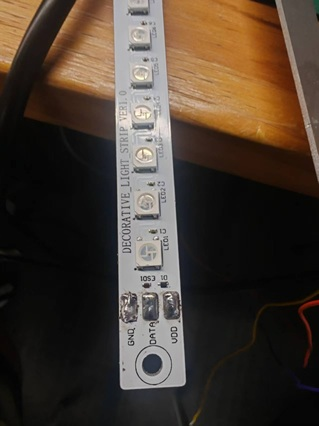
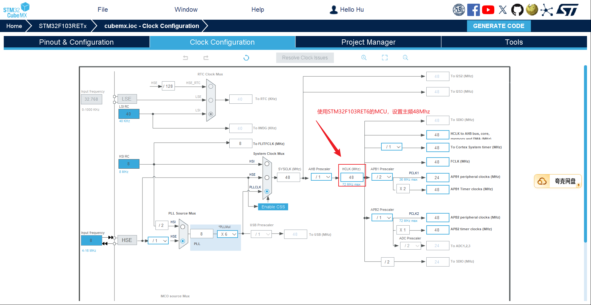
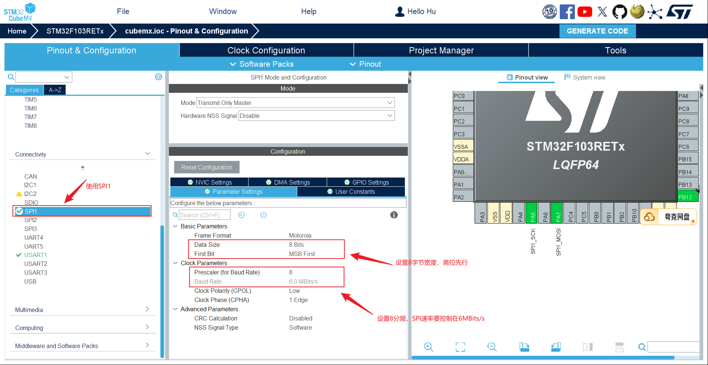

# <font size=3>一、 工程介绍</font>

```bash
create_at：2025/09/08
aliases：验证WS2812B-RGB灯带以及驱动函数
hardware：STM32F103RET6最小系统板
software：RT-Thread
```
<font size=2>```ws2812b driver```是一款基于 SPI 的 WS2812B 灯带驱动软件包，基于 RT-Thread SPI框架 设计。通过 SPI 高速输出编码数据，实现流畅、稳定的多彩灯效展示。</font>

## <font size=2>1. RGB灯带接口说明</font>
<font size=2>为快速验证RGB灯带的可用性,节省焊接成本，本次RGB灯带板的主控板使用自制的STM32F103RET6最小单片机系统板，RGB板为外置的铝基板，板上预留MOSI的数据引脚接口，以及VDD和GND接口。</font>


## <font size=2>2. 主要功能特性</font>
<font size=2> 
📌 支持 SPI 接口驱动 WS2812B 灯带</br>
📌 支持单颗灯珠独立控制颜色</br>
📌 支持批量设置所有灯珠统一颜色</br>
📌 支持动态调整全局亮度（0~255）</br>
📌 内置 Gamma 校正，显示更自然</br>
📌 提供多种灯效示例（如流水灯、呼吸灯）</br>
📌 支持通过 Kconfig 自定义 SPI总线、设备名称、片选引脚、灯珠数量</br>
</font>

# <font size=3>二、RTT 配置说明</font>

<font size=2> STM32单片机的普通SPI接口实现不了 220ns~580ns 这么精细高低电平输出，于是把 1-bit 数据扩展成 8个SPI位(一个字节)，利用 SPI 的 ```750 kHz × 8 = 6.0 Mbit/s```的速率来“冒充”精确时长，因此需要对单片机的主频和SPI的预分频系数进行修改，以达到SPI速度```6.0Mbits/s```的要求。

| 宏                 | 值        |含义                       |
| ------------------ | ---- | ------------------------------ |
| `WS2812B_RGB_BITS` | 24   | 每颗灯 24 位数据（GRB 各 8 位）             |
| `WS2812B_CODE_0`   | 0xC0 | 用 SPI 发 0b11000000，模拟 0 码（高 220 ns） |
| `WS2812B_CODE_1`   | 0xF0 | 用 SPI 发 0b11110000，模拟 1 码（高 580 ns） |

单片机设置，打开CubeMX，此处特别强调以下两点配置，其他按照正常流程配置即可，就不做复述：
1. 设置单片机主频为48Mhz



2. 设置SPI的预分频系数使SPI的波特率到6.0MBits/s



</font>


# <font size=3>三、注意事项</font>
<font size=2>

⚡ 请确保你的 SPI 总线速度设置为 6MHz 左右，以满足 WS2812B 灯带时序要求。
⚡ 如果出现灯带无法点亮、闪烁异常等问题，请优先检查主控芯片主频设置是否合理。 不同主频可能导致SPI时序偏差，需要保证时序符合WS2812B要求。
⚡ SPI通信需要注意片选引脚（CS）是否正确配置。
⚡ 大量灯珠（如>100颗）时，需要适当控制刷新频率，以避免阻塞系统任务。

**实测结果：**
==STM32F103 系列，主频48MHz环境下，灯效显示正常==
==STM32H743 系列，主频68MHz环境下，灯效显示正常==


</font>
